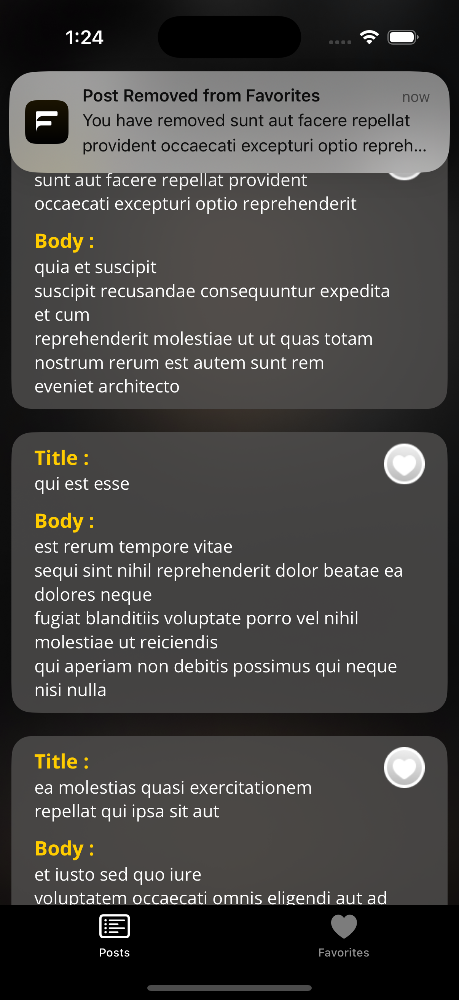

# FakeBook
Fakebook: A Social Media Mockup

Overview

Fakebook is an iOS application that simulates a simple social media platform. It allows users to view a list of mock posts from the network, save their favorite posts, and view post details along with a list of comments. The application is designed with a focus on user experience, featuring a modern and responsive design, with full offline functionality support.

Key Features

Main Tabs

Posts Tab:

Displays a list of posts fetched from JSONPlaceholder API.

The list remains available even if there is no internet connection.

Notifies the user if the internet connection is unavailable.

Clicking on a post opens a detail screen that displays the post details and its associated comments.

A button to add/remove the post from the favorites list.

Favorites Tab:

Displays a list of all posts that have been added to favorites.

If a post is favorited while offline, it syncs with the server automatically once the internet connection is restored.

A local notification is sent to inform the user when synchronization is completed.

Additional Features

Full Offline Support:

Ability to save favorite posts locally using Core Data.

Automatic synchronization of favorite posts with the server when back online.

Responsive Design:

Supports all screen sizes and iOS devices.

Dynamic cell height to ensure all content is displayed without truncation.

Testing & Notifications:

Unit testing ensures code quality.

UI testing guarantees a smooth user experience.

Local notifications inform users about internet connection status and data synchronization.

Custom Design & Architecture:

Custom fonts and design extensions for a unique user experience.

Implemented using MVVM (Model-View-ViewModel) architecture.

Utilized Singletons and Dependency Injection for better scalability and maintainability.

Technologies Used

Swift - The main programming language used for development.

Core Data - For local storage and offline support.

Unit Testing & UI Testing - To maintain application quality.

JSONPlaceholder API - A mock API for retrieving posts and comments.

Local Notifications - To inform users about internet status and synchronization.

API References

Base URL: https://jsonplaceholder.typicode.com

Posts Endpoint: /posts

Comments Endpoint: /posts/{post_id}/comments

Getting Started

Clone the repository:

git clone https://github.com/HosamTalaat/FakeBook.git
cd Fakebook

Open the project in Xcode.

Run the application on a real iOS device or simulator.

Testing

To run the tests:

Open the project in Xcode.

Go to Product -> Test.

Notes

The application follows best practices in iOS development.

The code is well-organized and documented for easy maintenance and future development.

All design components, including the app icon, logo, and all icons, were created by me using Figma specifically for this project.

Contributions

Contributions are welcome! If you’d like to contribute to the project, follow these steps:

Fork the repository.

Create a new branch for your feature or fix.

Implement the changes and perform necessary tests.

Submit a Pull Request to the main repository.

## Preview

|                             |                             |
| :--------------------------: | :--------------------------: |
|      **Core Screens**       |      **States/Alerts**      |
|   |   |
|  |  |
|    **Empty/Loading**   |    **Other Views/Alerts**    |
|   |  |
|   |  |
|   |  |
|                                 |  |
